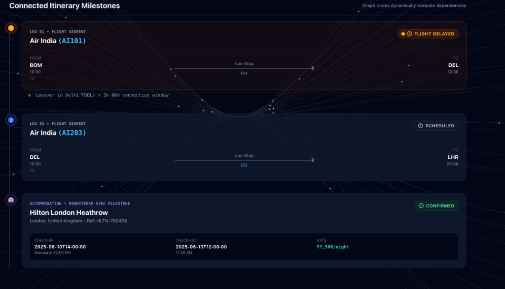
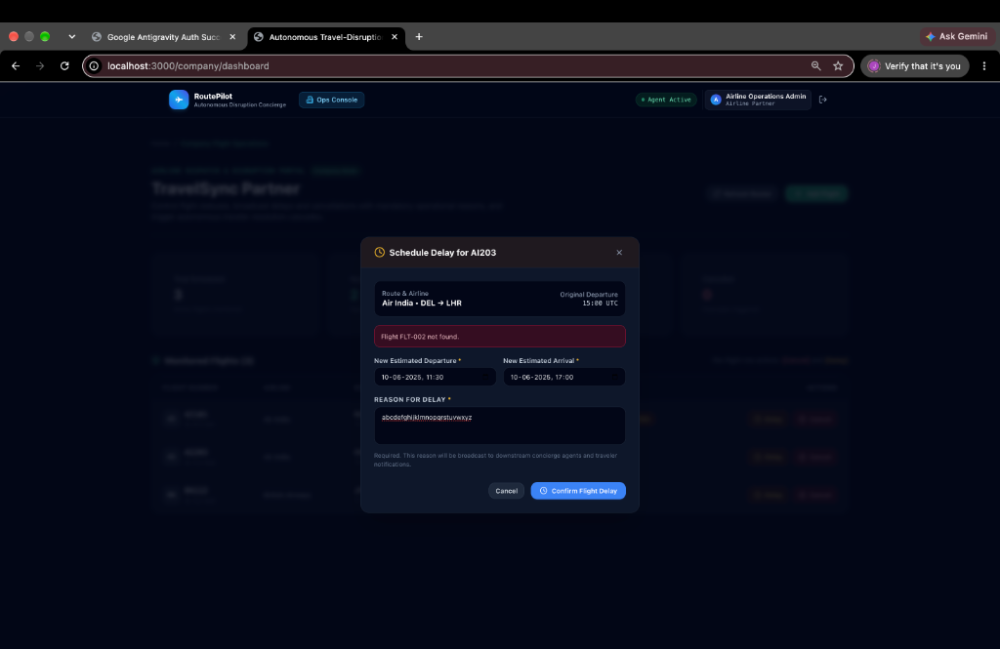

<div align="center">
  
  <h1>RoutePilot</h1>
  <p><strong>The Autonomous Travel-Disruption Concierge</strong></p>
  <p><em>Built for Bit-N-Build '26</em></p>
  
  [](https://nextjs.org/)
  [](https://fastapi.tiangolo.com/)
  [](https://tailwindcss.com/)
</div>

<br />

## 🚨 The Problem

When a flight is delayed or cancelled, travelers are plunged into a chaotic nightmare. They spend hours on hold with customer service, frantically trying to rebook connecting flights and adjust hotel reservations before they lose their money. Meanwhile, airlines lose millions in operational inefficiencies and customer dissatisfaction. **The travel industry’s disruption management is reactive, manual, and broken.**

## ✨ Our Solution: RoutePilot

**RoutePilot** is an autonomous travel-disruption concierge that completely automates the recovery process. When an airline announces a delay or cancellation, RoutePilot’s intelligent backend instantly:
1. **Detects** the disruption in real-time.
2. **Evaluates** the downstream impact (e.g., will the traveler miss their connection? Will they arrive after hotel check-in?).
3. **Autonomously Re-plans** the itinerary by finding and securing alternative flights and adjusting accommodation dates.
4. **Notifies** the traveler with a fully updated, stress-free itinerary.

### Why This Wins

- **Complete End-to-End Execution**: We built a fully functional multi-user architecture with both a Traveler Dashboard and an Airline Operations Center.
- **Flawless UI/UX**: A highly polished, animated, and responsive user interface that looks like a premium, production-ready product.
- **Complex State Management**: The backend autonomously evaluates a graph of connected travel segments, handling edge cases like missing connections and hotel rebookings seamlessly.

---

## 📸 See It In Action

### The Traveler Timeline
A beautiful, node-based visual graph that tracks the user's journey. When disruptions occur, the UI instantly highlights the impacted segments and provides the downstream rebooking status.



### Airline Operations Dashboard
A powerful operations console where airline staff can broadcast delays or cancellations. Our backend processes these events and instantly pushes autonomous recovery actions to the affected travelers.



---

## 🚀 Key Features

* **Multi-Actor System:** Features distinct experiences for Travelers and Airline Operations.
* **Autonomous Replanning Engine:** Algorithms that calculate minimum connection times and autonomously query alternative routes when thresholds are breached.
* **Interactive Disruption Simulation:** We built a dedicated "Activity" hub to simulate real-world delays and cancellations, proving our backend logic works in real-time.
* **Smart Downstream Syncing:** If you miss your connection, RoutePilot doesn't just rebook your flight—it automatically updates your destination hotel reservation to match your new arrival time.
* **Glassmorphic & Fluid Design:** The UI utilizes advanced CSS, backdrop blurs, and smooth micro-animations for an unparalleled user experience.

## 🛠️ Tech Stack

**Frontend:**
* Next.js 14 (App Router)
* React & TypeScript
* Tailwind CSS
* Lucide Icons

**Backend:**
* Python 3 & FastAPI
* SQLAlchemy (ORM)
* SQLite (Zero-config embedded database)
* Uvicorn (ASGI Web Server)

---

## ⚙️ Getting Started (Local Development)

### 1. Start the Backend
```bash
cd backend
python -m venv venv
source venv/bin/activate
pip install -r requirements.txt

# The database will automatically seed itself with demo data on startup!
uvicorn main:app --host 0.0.0.0 --port 8000 --reload
```

### 2. Start the Frontend
```bash
cd frontend
npm install
npm run dev
```

Visit `http://localhost:3000` to access the application.

---

<div align="center">
  <p>Made with ❤️ by team Bit N Built-26</p>
</div>